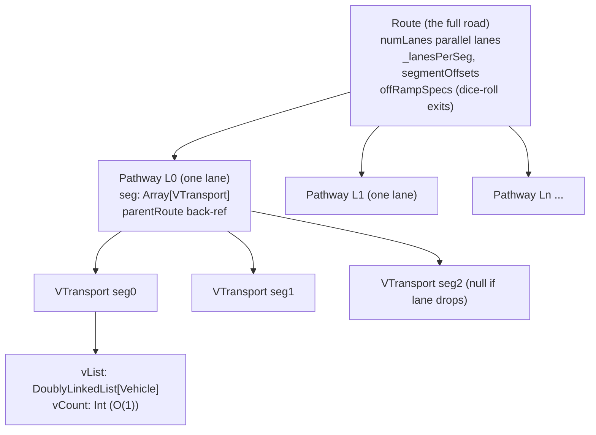
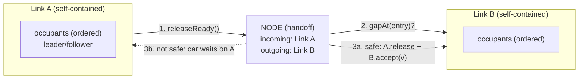
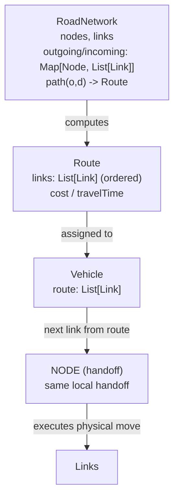

# Current System Diagram + What We Need To Do

> PART I = the **existing** micro architecture (as-is, honest).
> PART II = the **plan** to make the current micro composable (meso deferred).
> This documents reality and the agreed path — not a target cathedral.

---

# PART I — WHAT WE HAVE NOW

## 1. The road as an implicit graph (edges wired by pointers)

There is **no `Graph` object**. Topology is emergent — each edge holds `from`/`to` refs.

```
 VSource ──VTransport──▶ Junction ──VTransport──▶ Junction ──VTransport──▶ Sink
  (node)     (edge)       (node)      (edge)        (node)      (edge)      (node)

 nodes  = Component subclasses: VSource, Junction, Sink
 edges  = VTransport  (val from: Component, val to: Component)
 Model  = flat bag: parts: VEC[Component]   ← NOT an adjacency structure
```

Adjacency is recoverable (walk edges, read `from`/`to`) but **not queryable** —
there is no `node.outgoing` / `node.incoming`.

## 2. Road container hierarchy (organizational wrappers)



- **Route** = N parallel `Pathway`s between the same `from` / `junc[]` / `to`.
- **Pathway** = one lane = ordered `seg: Array[VTransport]` (null where lane doesn't exist).
- **VTransport** = one lane-segment (the real edge). Owns the car-following DLL.
- Vehicle traverses by indexing `Pathway.seg[]` **in hardcoded order** — not by routing.

## 3. Car-following core (this part is sound)

```
 VTransport
   └── vList : DoublyLinkedList[Vehicle]     ← single source of truth
          leader   = node.prev  (O(1) pointer)
          follower = node.next  (O(1) pointer)
          vCount   = occupancy   (O(1))
          flowRate = vList.length / window   ← already computable

 Vehicle (coroutine, own thread)
   └── Dynamics: IDM / Gipps / Krauss   (car-following accel)
   └── MOBIL                            (lane-change, speed-gain only)
   └── myRoute, myPathway, myPathNode
```

Clocks that already exist:
- **DES director** (event scheduling)  → coarse clock
- **Vehicle coroutine time-step**       → fine clock

## 4. OSM layer — a picture, not a graph

```
 download_osm_geometry.py ──▶ <name>_roads.json (polylines + places)
                                     │
                          OsmRoadNetwork.load()
                                     │
             polylines: Array[Array[(Double,Double)]]   ← flattened
             (osm_id discarded, no node reconciliation,
              no connectivity, no lane data)
                                     │
                          DgAnimator (rendering only)
```

Used for **background visuals**. Carries **no topology** the simulation can traverse.

## 5. What is NOT here (the gaps)

| Missing piece | Consequence |
|---|---|
| Queryable network graph (`node.outgoing`) | No shared topology |
| Node-as-boundary object | Nowhere clean to hand vehicles across |
| `Link` interface (flow/density/capacity contract) | Nothing to hand off to |
| Routing layer (paths over graph) | Exits are a dice-roll (`OffRampSpec`) |
| Lane-level connectivity at junctions | No turn movements, no strategic lane change |

## 6. One-line summary (current)

**Micro physics = sound (IDM/MOBIL/DLL). Micro network abstraction = not boundary-ready.**
The seam a hybrid needs lives at a *node*. The merge (ramp→mainline) is the first place that
seam must be built ("Boundary v0").

---

# PART II — WHAT WE NEED TO DO

> Scope: make the **current micro** composable. Meso is deferred (not in this plan).
> Two phases: LOCAL first (build + validate), GLOBAL only when routing is needed.

## 7. Two sizes of "graph" — do not confuse them

| Term | Size | Needed now? |
|---|---|---|
| **Local** | a node knowing its **2** links (A in, B out) | ✅ Yes — build first |
| **Global (`RoadNetwork`)** | index of the **whole** network for routing | ❌ Not yet |

Dependency is one-way: **local works alone; global cannot skip local.**
- Local = the physical **handoff** (gap check, move car A→B).
- Global = **routing** (which link is next). Picks the path; still calls local to execute.

`RoadNetwork` earns its place the first time a vehicle has a **real choice tied to a
destination** (grid / alternate routes / retire the dice-roll / strategic lane change).
Not before.

## 8. LOCAL design — the handoff (BUILD FIRST)

Each link is self-contained. Links never poke each other's DLL. A node moves the car across.



**Components**
- **Link (contract/trait)** — `releaseReady()`, `gapAt(side)`, `accept(v)`. Talks to no other link directly.
- **Node (handoff)** — holds *local* refs to its 2 links; owns the decision.
- **HandoffEvent** — "vehicle ready at A" scheduled on the director; node resolves it.

**Data**
```
Link:    id; entryNode, exitNode; occupants (ordered); length; nLanes
Node:    id; incoming: List[Link]; outgoing: List[Link]
Handoff: (fromLink, vehicle) -> gapAt(toLink) -> release + accept
```

**Start point:** the merge (ramp→mainline) = **Boundary v0**. Micro on both sides.

## 9. GLOBAL design — routing (LATER, only when there are choices)

Sits **on top** of local. Picks *which* link is next; the node handoff still executes the move.



**Data**
```
RoadNetwork: nodes: Set[Node]; links: Set[Link]
             outgoing(n)/incoming(n): List[Link]; path(o,d): Route
Route:       links: List[Link]; cost: Double
Vehicle:     route: List[Link]
```

Global chooses next link → hands to the **same** local node handoff. Global never touches physics.

## 10. Design choice — inheritance vs composition (get this right)

Current `VTransport extends Transport` passes **`null`** for Transport's `motion: Variate`
(VTransport uses `Dynamics` instead). That `null` is the tell: it's **inheritance-for-reuse,
not IS-A**. Leaky base fit + fragile base class. Do NOT repeat this pattern for `Link`.

| Get via | What |
|---|---|
| **Inheritance** (keep) | `Component` base — engine plumbing (Identifiable, Locatable, animation) |
| **Composition** (use) | geometry (curve/endpoints) + dynamics (IDM) — *held*, not inherited |
| **Trait** | `Link` — the contract; VTransport-lane implements it |

Rule: don't inherit a concrete edge to reuse its geometry — **hold** the geometry.

## 11. What gets DELETED / retired (grounded in actual code)

Each entry: WHERE it is · WHAT it does today · WHY it goes · WHAT replaces it · WHEN.
Line numbers are from the code as read on 2026-07-15 — re-check before editing.

### LOCAL phase — build the node handoff, delete the blind inserts

**D1 — Blind ramp merge**
- WHERE: `Route.mergeFromRamp` — `Route.scala:232-238`
- TODAY: `getLast` on the mainline segment, then `addToAlist` behind it. **No gap check.**
  (Called from `EatonFireModel.scala:388`.)
- WHY: this is the CLAUDE.md "no gap acceptance at merge" bug — ramp car inserts on top of
  whoever is there.
- REPLACED BY: node handoff that runs a gap check before `accept`.
- NOTE: the gap check already exists — `changeLane` at `Route.scala:206`
  (`gapBehind >= safeDisp && gapAhead >= safeDisp`). The fix is to apply *that* to the
  merge path, not invent it.

**D2 — Blind FF-interchange insert (I-210 → SR-134)**
- WHERE: `EatonFireModel.scala:437-438`
- TODAY: same pattern — `getLast` + `addToAlist` into SR-134, no gap check.
- REPLACED BY: node handoff at the FF merge junction (same one as D1).

**D3 — Vehicle coroutine inlines the DLL hop**
- WHERE: `driveHighway` — `EatonFireModel.scala:446, 455-457` (also `421, 428, 430`)
- TODAY: the *vehicle* directly calls `seg(seg).removeFromAlist(this)` then
  `nextVT.addToAlist(this, ahead)` to cross each junction.
- WHY: the link boundary is not a real handoff — the traveler reaches into each link's DLL.
- REPLACED BY: node owns remove-from-A / add-to-B; the coroutine only *requests* the hop.
- NOTE: the `vList` DLL itself STAYS — we delete the *vehicle's direct manipulation of it
  across junctions*, not the list.

### GLOBAL phase — later, only when routing exists

**D4 — OffRampSpec dice-roll**
- WHERE: `Route.scala:30-81` (`OffRampSpec` + `buildExitDist` + `assignExit`),
  field `Route.offRampSpecs` `Route.scala:101`, steering `exitCheckAndSteer`
  `Route.scala:285-316`.
- TODAY: at spawn a dice-roll picks an exit ramp (or through); `exitCheckAndSteer` then
  force-changes lanes toward it.
- REPLACED BY: `Vehicle.route: List[Link]` computed over `RoadNetwork`; the exit is just a
  node on the route.

**D5 — FF probabilistic split (second hidden router)**
- WHERE: `EatonFireModel.scala:414-418` (`rand.gen < currentSplitRatio`).
- TODAY: each I-210 car randomly diverts to SR-134 at the interchange.
- REPLACED BY: routing over the graph — the interchange becomes a node with a real turn.

**D6 — Hardcoded seg-by-seg traversal**
- WHERE: `driveHighway` `EatonFireModel.scala:401-467`, entry select `actOnCorridor`
  `EatonFireModel.scala:363-396`.
- TODAY: `while seg < hwLen` walks `seg(0)..seg(hwLen)` in fixed order.
- REPLACED BY: iterate `Vehicle.route` (List[Link]); node handoff advances the car.

### STAYS untouched (both phases)
- `changeLane` gap logic (`Route.scala:169-220`) — it's the *template*, not a target.
- IDM / Gipps / Krauss + MOBIL physics · `vList` DLL · Vehicle coroutine · DES director.

### The rule across all rows
Each new layer becomes the single source of truth — the old hardcoded version is
**deleted, not run alongside**. Note there are currently **two** hidden routers (D4 dice-roll,
D5 FF split); both must go, or routing has three authorities and rots.

## 12. Build order

```
LOCAL  1. Link trait (releaseReady / gapAt / accept)  -- VTransport-lane implements it
       2. Node handoff (2 local link refs)
       3. Merge -> node handoff (delete blind insert)   <- Boundary v0, VALIDATE HERE
--------------------------------------------------------------------------------
GLOBAL 4. RoadNetwork index (derive adjacency)          <- only when routing needed
       5. Vehicle.route: List[Link]  (delete seg[] walk + OffRampSpec dice-roll)
```

Stop after step 3 and validate. Do not start GLOBAL until a real routing choice exists.
