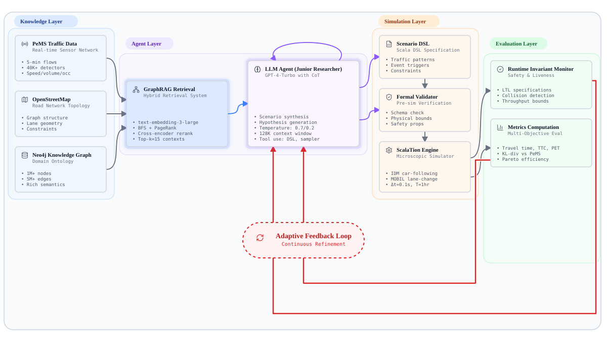
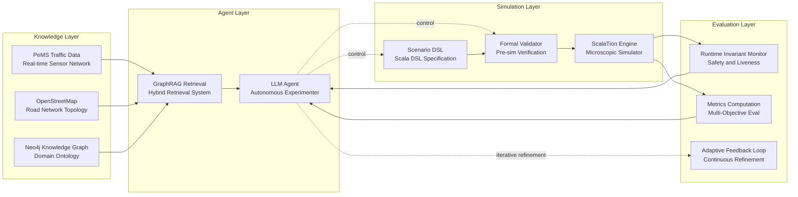

# Korede R. Bishi
**Ph.D. Student, Computer Science, University of Georgia**

**Research Area:** Discrete Event Simulation, Empirical Validation, and Agentic Simulation Systems
**Application Domain:** Microscopic Traffic Simulation

---

## About

I am a third-year Ph.D. student in Computer Science at the University of Georgia working in the Modeling, Simulation & Analytics Lab (MSAL) under the supervision of Dr. John A. Miller.

I build validated digital twins of real transportation systems — and I am proposing an agentic architecture where LLM-driven agents autonomously design and evaluate simulation experiments. My work sits at the intersection of discrete-event simulation, empirical validation, and agentic AI.

I extend the [ScalaTion 2.0](https://github.com/scalation/scalation_2.0) simulation framework with lane-level validation, constrained calibration infrastructure, and structural intervention modeling for high-stakes infrastructure scenarios — validated against empirical sensor data from the [California Performance Measurement System (PeMS)](https://pems.dot.ca.gov/).

---

## Research Vision

My dissertation investigates a fundamental question in simulation science:

> **Can we build empirically validated microscopic simulation models that are trustworthy enough for counterfactual infrastructure policy evaluation under extreme disruption, and can agentic AI systems autonomously design, execute, and refine such experiments at scale?**

Answering this requires solving three interconnected problems: (1) understanding which modeling decisions actually affect simulation accuracy, (2) establishing that the validated model produces a trustworthy digital twin, and (3) applying that digital twin to a high-stakes policy question where real-world experimentation is impossible.

The long-term vision is an agentic simulation framework, where AI-driven agents autonomously design, execute, and refine simulation experiments, grounded in empirically validated models of real infrastructure systems, enabling scientific discovery at a scale and speed impossible through manual experimentation.

I address these through three studies, each building on the previous:

- **Study 1** establishes which modeling choices matter and which do not.
- **Study 2** applies the validated model to evaluate wildfire evacuation resilience and contraflow effectiveness on a real freeway corridor.
- **Study 3** extends the framework toward a unified agentic architecture for autonomous simulation-based experimentation (proposed).

All three studies extend the **ScalaTion framework** (developed by Dr. John A. Miller and collaborators) and validate against real-world sensor data from the California Performance Measurement System (PeMS).

---

> **[View Full Proposal: Study 3 - Agentic Architecture](#study-3-proposed-agentic-simulation-architecture)**  
> *(Architecture diagram hosted live on website — placeholder below)*

---

## Study 1: Which Modeling Decisions Matter?
*ANNSIM 2026 (Accepted)*

**Title:** "Beyond Corridor Averages: Lane-Level Validation of Microscopic Freeway Simulation with Data-Driven Arrivals"

**Motivation:**  
Microscopic traffic simulators require many modeling choices: numerical integration schemes, vehicle arrival processes, time-step resolution. The sensitivity of simulation accuracy to these choices is poorly understood. Practitioners often adopt defaults without systematic evaluation.

**Approach:**  
We systematically varied two key modeling decisions: numerical integrator (8 methods, from Euler to Dormand-Prince) and vehicle arrival process (Poisson, Erlang-2, shifted Erlang-2), and evaluated their impact on lane-level flow and speed accuracy across five PeMS detector stations on a US-101 freeway corridor.

**Key Findings:**
- Numerical integrator choice has **less than 1% impact** on simulation accuracy: simple ballistic integration suffices
- Vehicle **arrival process modeling substantially affects fidelity**: the shifted Erlang-2 distribution reduces flow error by ~28% compared to Poisson by enforcing a realistic minimum headway
- **Lane-level validation** reveals dynamics that corridor-level aggregation obscures

**Significance:**  
These findings direct calibration effort toward the modeling decisions that matter (arrival processes) and away from those that do not (integrators), informing Study 2.

---

## Study 2: Wildfire Evacuation Resilience & Contraflow Evaluation
*WSC 2026 — Simulation for Climate Resilience (Active Target)*

**Title:** "Evaluating Evacuation Resilience Under Wildfire Disruption: A PeMS-Calibrated Microscopic Simulation of I-10 During the 2025 Palisades Fire"

**Motivation:**  
On January 7, 2025, the Palisades Fire triggered mass evacuation along I-10 eastbound in Los Angeles. Severe congestion and smoke degraded corridor performance for hours. A recurring policy question: whether directional lane reallocation (contraflow) would have improved evacuation throughput, cannot be answered through real-world experimentation. Simulation provides the only feasible evaluation method.

**Approach:**
1. **Baseline calibration:** Reproduce normal-day I-10 traffic dynamics using PeMS data and the validated arrival process methodology from Study 1
2. **Fire-day reconstruction:** Detect demand surge timing from PeMS, reconstruct the congestion event in simulation
3. **Smoke-behavior modeling:** Translate smoke exposure into driving behavior degradation (reduced desired speed, increased headway, reduced lane-change aggressiveness)
4. **Counterfactual scenarios:** Evaluate evacuation performance under multiple capacity configurations: baseline, partial contraflow, full contraflow, and contraflow under smoke

**Evaluation Metrics:**
- Evacuation throughput (vehicles/hour)
- Mean corridor speed
- Congestion clearance time
- Resilience index: R = 1 − (performance loss area / baseline area)

**Expected Contributions:**
- First PeMS-calibrated microscopic reconstruction of the 2025 Palisades Fire evacuation
- Smoke-as-behavioral-degradation module for microscopic DES
- Quantitative counterfactual evaluation of contraflow effectiveness under visibility impairment
- Identification of conditions under which capacity expansion alone is insufficient, requiring behavioral adaptation

**Target:** Winter Simulation Conference 2026 — *Simulation for Climate Resilience* track

---

## Study 3: Proposed Agentic Simulation Architecture
*Proposed — Long-Term Dissertation Vision*

**Motivation:**  
Studies 1 and 2 establish that high-fidelity, empirically validated microscopic simulation is achievable. The next challenge is scale: manual experiment design limits how much of the scenario space a researcher can explore. This study proposes a unified agentic architecture where AI-driven agents autonomously design, execute, and refine simulation experiments, grounded in the validated digital twin developed in Studies 1 and 2.

**The Core Idea:**  
Rather than a researcher manually specifying each simulation scenario, an LLM-driven agent reasons over a knowledge graph of the road network, generates structured simulation scenarios via a domain-specific language (DSL), validates them before execution, runs them through the ScalaTion engine, and iteratively refines experiments based on results. This enables scientific discovery at a scale and speed impossible through manual experimentation.

**Proposed Architecture:**

**Four Layers:**
- **Knowledge Layer:** PeMS sensor data, OpenStreetMap road topology, Neo4j knowledge graph
- **Agent Layer:** GraphRAG retrieval provides network context to an LLM agent that autonomously proposes simulation scenarios
- **Simulation Layer:** Scenarios are expressed as a Scala DSL, validated before execution, then run through the ScalaTion microscopic simulator
- **Evaluation Layer:** Runtime invariant checks protect simulation correctness; metrics feed back to the agent for iterative refinement

**Expected Contributions:**
- Agentic experimentation loop for microscopic traffic simulation
- DSL-based scenario generation that separates LLM reasoning from simulation execution
- Runtime invariant framework ensuring physical validity of agent-generated scenarios
- Scalable exploration of evacuation and infrastructure resilience scenarios

**Status:** Proposed. This architecture is the long-term dissertation vision and the subject of the candidacy proposal.

---

## Technical Contributions to ScalaTion

Extending the ScalaTion simulation framework, I have contributed:

| Contribution | Description |
|---|---|
| **Lane-level validation** | Per-lane flow and speed recording with automated PeMS data comparison |
| **Constrained calibration framework** | Flow-protected fitness function with physically grounded parameter bounds |
| **Car-following model suite** | IDM, Gipps, and Krauss dynamics with configurable ODE solvers |
| **Route abstraction** | Doubly-linked segment structure for multi-lane freeway corridors |
| **Ramp modeling** | On-ramp merge behavior using VTransport |
| **HPC calibration pipeline** | SLURM array job orchestration for parallel optimizer evaluation |
| **Simulation reporting** | Automated CSV/TXT export of per-sensor, per-lane validation metrics |

---

## Publications

### Accepted
1. **Bishi, K.R.**, Bowman, J., Miller, J.A. (2026). "Beyond Corridor Averages: Lane-Level Validation of Microscopic Freeway Simulation with Data-Driven Arrivals." *Annual Modeling and Simulation Conference (ANNSIM)*. [Accepted]

### In Preparation
2. **Bishi, K.R.**, Miller, J.A. (2026). "Evaluating Evacuation Resilience Under Wildfire Disruption: A PeMS-Calibrated Microscopic Simulation of I-10 During the 2025 Palisades Fire." *Winter Simulation Conference (WSC) — Simulation for Climate Resilience*. [Target: April 2026]

---

## About ScalaTion

**ScalaTion** is a Scala-based framework for simulation, optimization, and analytics developed by Dr. John A. Miller and collaborators at the University of Georgia. The framework supports:

- **Multiple simulation paradigms:** Process-oriented, event-driven, and time-stepped simulation
- **Continuous-time models within discrete-event frameworks:** e.g., IDM car-following integrated via configurable ODE solvers
- **Native optimization:** SPSA, Nelder-Mead, Genetic Algorithms
- **Analytics:** Statistical modeling, machine learning, and database connectivity

My work extends ScalaTion's traffic simulation capabilities for microscopic freeway modeling with real-world validation.

---

## Education

**Ph.D. Computer Science** (In Progress)  
University of Georgia  
Advisor: Dr. John A. Miller  
Track: Simulation and Analytics

**Relevant Coursework:**
- Algorithms, Software Engineering, Computer Networks
- Cloud Computing, Advanced Distributed Systems
- Trustworthy Machine Learning, Advanced Representation Learning
- Transportation Planning (Spring 2026)

---

## Contact

**Email:** krb84578@uga.edu  
**Advisor:** Dr. John A. Miller  
**Lab:** ScalaTion Research Group, University of Georgia

© 2026 Korede R. Bishi | University of Georgia

