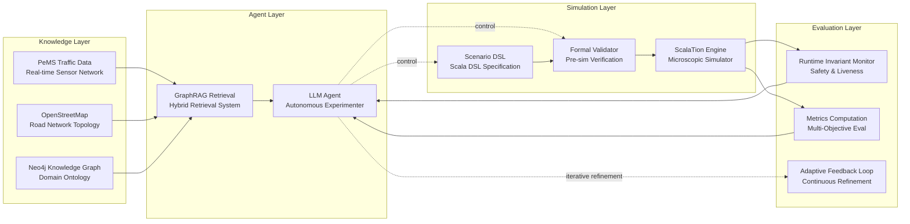

# Executive Architecture Summary

## Agentic Experimenter for Microscopic Traffic Simulation

### Target Application

Wildfire evacuation and contraflow evaluation on the I-10 corridor during the Palisades Fire scenario using a data-calibrated microscopic traffic simulator.

The system enables an LLM-driven agent to autonomously design and execute simulation experiments while preserving physical validity and simulation correctness through structured constraints and validation layers.

The architecture integrates:

- real traffic data
- knowledge graphs
- LLM reasoning
- DSL-based scenario generation
- simulation execution
- automated evaluation

to support agentic scientific experimentation on transportation systems.

---

# 1. Research Objective

Develop an Agentic Experimenter system capable of autonomously exploring evacuation strategies in a microscopic traffic simulation environment.

The agent should be able to:

- design simulation scenarios
- modify evacuation strategies
- evaluate contraflow policies
- analyze evacuation performance
- iteratively refine experiments

The system acts as a simulation research assistant capable of running structured traffic experiments.

---

# 2. Foundational Simulation Engine

The simulation core is implemented using the ScalaTion microscopic traffic simulation framework.

The engine models:

- vehicles
- lanes
- merges
- event scheduling
- car-following behavior
- lane-changing dynamics
- network topology

The simulation engine is trusted infrastructure and is never modified by the LLM.

This separation ensures that simulation physics and causality remain protected.

---

# 3. Real-World Data Sources

The system uses empirical traffic datasets to calibrate and reconstruct realistic traffic dynamics.

### Primary Dataset

Caltrans PeMS traffic data

Provides:

- lane-level flow
- speed
- occupancy
- sensor metadata

These data support:

- baseline calibration
- wildfire-day congestion reconstruction
- demand surge estimation

---

# 4. Transportation Network Representation

Road network structure is derived from OpenStreetMap (OSM).

The network may be stored in a Neo4j knowledge graph, representing:

**Nodes:**
- road segments
- lanes
- sensors
- ramps

**Edges:**
- connectivity
- lane adjacency
- merges
- corridor topology

This representation enables structured reasoning about network structure.

---

# 5. Graph-Based Knowledge Retrieval

The agent can access the knowledge graph through GraphRAG (Graph Retrieval Augmented Generation).

GraphRAG allows the LLM to retrieve contextual information such as:

- corridor geometry
- lane counts
- sensor placement
- ramp connections

This ensures that generated simulation scenarios remain consistent with network structure.

---

# 6. DSL-Based Scenario Generation

To prevent unsafe code generation, the LLM does not generate simulation code directly.

Instead, it generates a structured Scala DSL describing simulation scenarios.

Example scenario specification:

```
scenario "Wildfire_I10" {
  corridor "I10_EB"
  surge at "10:30" scale 1.8
  smoke moderate
  contraflow +1 preserveInbound 1
}
```

The DSL defines:

- demand surge conditions
- smoke-induced behavioral degradation
- contraflow lane allocation
- corridor selection

The DSL is interpreted by the simulation engine.

---

# 7. Scenario Validation Layer

Before simulation execution, DSL scenarios undergo validation checks.

These checks ensure:

- valid lane configurations
- preservation of inbound emergency lanes
- corridor existence
- valid parameter ranges
- structural consistency

Invalid scenarios are rejected before simulation begins.

---

# 8. Agentic Experiment Loop

The core of the architecture is an agentic experimentation loop.

The agent repeatedly designs and evaluates simulation scenarios.

```
define research objective
↓
generate simulation scenario (DSL)
↓
validate scenario
↓
run simulation
↓
collect metrics
↓
analyze results
↓
propose new experiment
↓
repeat
```

This loop allows the agent to search the experiment space autonomously.

---

# 9. Tool-Based Agent Architecture

The agent interacts with the system through structured tools.

### Scenario Generation Tool
Produces DSL scenario configurations.

### Network Query Tool
Retrieves topology information from Neo4j.

### Simulation Runner Tool
Executes the traffic simulation.

### Validator Tool
Checks scenario consistency.

### Metrics Tool
Computes evacuation performance metrics.

These tools enable structured reasoning and experimentation.

---

# 10. Runtime Semantic Safety Layer

Simulation correctness cannot be guaranteed through static analysis alone.

The system therefore enforces runtime invariants to ensure physical plausibility.

Examples include:

### Vehicle collision prevention
Vehicles must maintain minimum spacing.

### Speed validity
Speeds must remain finite and non-negative.

### Flow conservation
Vehicle counts must remain consistent.

### Merge ordering
Vehicle ordering must remain physically valid.

### Event queue integrity
Simulation events must remain time-ordered.

These checks prevent semantic corruption of simulation results.

---

# 11. Static Code Analysis Support

If DSL-generated code or extensions are produced, static analysis tools may be used to detect unsafe patterns.

Scala tools include:

- Scalafix
- Scapegoat
- WartRemover

These tools detect:

- unsafe constructs
- null usage
- problematic code patterns

However, they complement but do not replace runtime simulation invariants.

---

# 12. Experimental Workflow

The agent conducts experiments related to wildfire evacuation dynamics.

The experiment phases include:

### Phase 1 — Baseline Calibration
Reconstruct normal traffic dynamics.

### Phase 2 — Fire-Day Reconstruction
Model demand surge from wildfire evacuation.

### Phase 3 — Smoke Impact Modeling
Simulate behavioral degradation due to smoke.

### Phase 4 — Contraflow Evaluation
Test counterfactual evacuation strategies.

---

# 13. Evaluation Metrics

Simulation performance is evaluated using traffic engineering metrics.

These include:

- throughput (vehicles/hour)
- mean speed
- congestion clearance time
- shockwave propagation speed
- resilience index

These metrics quantify evacuation performance.

---

# 14. Architecture Diagram



### Notes
- Knowledge Layer: PeMS, OSM, Neo4j
- Agent Layer: GraphRAG retrieval, LLM reasoning
- Simulation Layer: DSL generation, validation, ScalaTion execution
- Evaluation Layer: runtime invariants, metrics, feedback loop

---

# 15. Advantages of the Agentic Approach

The proposed system provides several benefits.

### Autonomous Experimentation
The agent can explore evacuation strategies without manual configuration.

### Safety and Correctness
DSL constraints and invariants protect simulation integrity.

### Data-Driven Modeling
Real traffic data ensures realistic scenarios.

### Scalable Experiment Design
Thousands of evacuation scenarios can be evaluated.

### Scientific Discovery
The system can identify evacuation strategies that improve resilience.

---

# 16. Long-Term Extensions

Future developments may include:

- multi-corridor evacuation modeling
- adaptive contraflow optimization
- integration with reinforcement learning
- real-time digital twin systems
- multi-agent experimentation

---

# Final Positioning Statement

This architecture introduces an LLM-driven Agentic Experimenter capable of autonomously generating and evaluating wildfire evacuation strategies in a microscopic traffic simulation environment.

By combining structured DSL scenario generation, graph-based knowledge retrieval, simulation execution, and runtime invariant enforcement, the system enables safe and scalable exploration of evacuation policies while preserving simulation validity.

---

# Paper A — LLM Agent for Traffic Simulation Experiment Design

## (The Agentic Experimenter Paper)

### Core Idea

Demonstrate that an LLM agent can autonomously design and execute traffic simulation experiments to explore evacuation strategies.

The novelty is not the traffic simulation itself — it is the agentic experimentation loop.

## Problem

Designing evacuation experiments manually is slow and biased.

Researchers typically test only a small number of scenarios.

Example:
- contraflow +1 lane
- contraflow +2 lanes
- no contraflow

But the scenario space is huge.

## Proposed System

Goal: Minimize evacuation clearance time

Agent loop:

```
generate scenario
↓
run simulation
↓
evaluate metrics
↓
propose new scenario
↓
repeat
```

The agent explores combinations like:

- +1 contraflow
- +2 contraflow
- +1 contraflow + moderate smoke
- +2 contraflow + severe smoke
- demand surge × 1.5
- demand surge × 2

## Contribution

LLM agents can autonomously explore evacuation strategies in traffic simulation environments.

## Evaluation

Compare:
- Human-designed experiments
- Agent-generated experiments

Measure:
- best evacuation strategy discovered
- search efficiency
- coverage of scenario space

## Good Venues
- ANNSIM
- Winter Simulation Conference (WSC)
- IEEE ITSC

---

# Paper B — Safe LLM Integration into Simulation Systems

## (The DSL + Invariant Paper)

### Core Idea

LLMs generating simulation code is dangerous because simulations can compile but produce invalid physics.

Solution: LLM generates a DSL instead of raw code, combined with runtime invariants.

## Problem

Simulation correctness is semantic, not syntactic.

Even perfect code can produce:

- vehicle overlap
- NaN speeds
- flow conservation violations
- broken event queues

Static analysis cannot catch these.

## Proposed Architecture

```
LLM
↓
DSL scenario
↓
validator
↓
simulation engine
↓
runtime invariants
↓
metrics
```

Safety layers:

1. DSL constraints
2. scenario validation
3. runtime invariant checks

## Contribution

A safe architecture for integrating LLMs into simulation systems.

Key idea: LLMs should generate structured scenario specifications, not simulation code.

## Evaluation

- Without DSL: LLM generated invalid simulations
- With DSL: invalid scenarios rejected

## Good Venues
- WSC (Winter Simulation Conference)
- ACM SIGSIM PADS
- Simulation Modelling Practice and Theory

---

# Paper C — Wildfire Evacuation Contraflow Analysis

## (The Domain Study)

This is the transportation paper. It uses the system but focuses on traffic science.

## Research Question

Does contraflow improve evacuation resilience during wildfire-induced congestion?

Study: I-10 corridor during Palisades Fire scenario

## Experimental Design

Scenarios:
- A: no contraflow
- B: +1 reversed lane
- C: +2 reversed lanes
- D: contraflow + smoke degradation

Metrics:
- evacuation throughput
- congestion clearance time
- shockwave speed
- resilience index

## Contribution

Provide data-calibrated evidence on contraflow effectiveness in wildfire evacuation.

## Good Venues
- Winter Simulation Conference
- Transportation Research Part C
- IEEE ITSC

---

# The Strategic Picture

All three papers share the same system.

```
Agent system
↓
DSL architecture
↓
contraflow experiments
```

Each emphasizes different aspects.

---

# Strategic Publication Order

1. **Contraflow Study** (WSC) — Fastest publishable.
2. **DSL Safety Architecture** (Simulation conference) — More systems-oriented.
3. **Agentic Experimenter** (AI + simulation) — Most novel but hardest.

---

# What Makes This Work Interesting

This work combines:

- traffic simulation
- LLM agents
- knowledge graphs
- DSL safety

Few researchers are working at this intersection.

